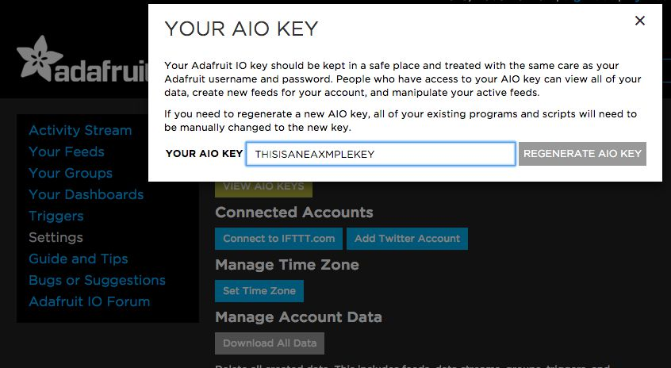

A cli tool for [adafruit.io](https://adafruit.io) written in go.

```sh
$ go get github.com/dhulihan/adafruit-io

$ adafruit-io feeds
Foo
Bar
...

$ adafruit-io get foo
98.6

$ adafruit-io send my-feed 98.6
OK 98.7 	
```

### Providing your key

`adafruit-go` requires your secret AIO key. 



You can provide it by using the `--key` flag

	adafruit-io --key 'MY_KEY' [...]

`adafruit-io` also looks for this key in the environment variable `$AIO_KEY`

	AIO_KEY='MY_KEY' adafruit-io [...]

To set it permanently, add this to `~/.bashrc|.zshrc`

	export AIO_KEY='MY_KEY'

## Usage

Get all feeds

	adafruit-io feeds
	# Foo
	# Bar
	# ...

Get latest value of a feed

	adafruit-io get foo
	# 98.6

Send a value to a feed (returns `OK [val]` if request is successful)

	adafruit-io send foo 98.7
	# OK 98.7 	

### Options

* `-d` - Debug mode
* `-v` - Version 
* `-k [API_KEY]` - Specify API key via. The envvar `$AIO_KEY` is tried before this.